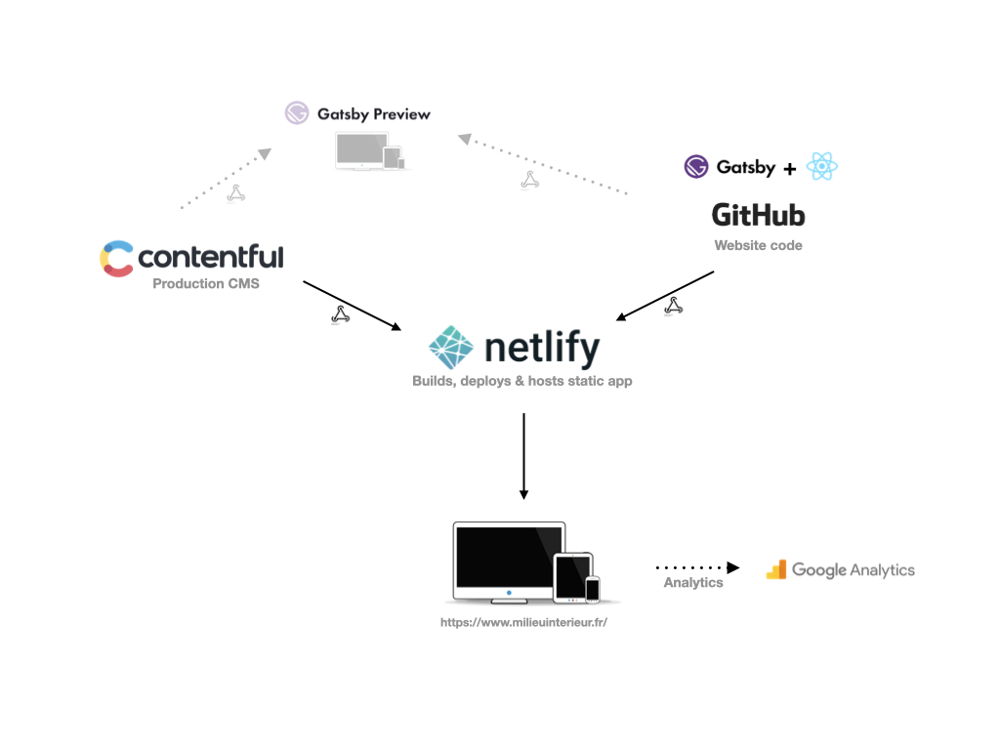

# milieu-interieur

## What is this repository for?

- This package builds the Milieu Intérieur project website.
- The website is built using the [Gatsby](https://github.com/gatsbyjs/gatsby/tree/gatsby%403.14.0) web framework.
- [Contentful](https://www.contentful.com/) is used as the production CMS and [as a Gatsby data source](https://github.com/gatsbyjs/gatsby/tree/master/packages/gatsby-source-contentful)

## How do I get set up?

Prerequisite: you will need [NodeJS](https://nodejs.org/en/) installed on your machine.

- Install [npm](https://www.npmjs.com/)
- Clone the repository `git clone git@github.com:richhigginsdigital/milieu-interieur.git` on to your machine and navigate to the repository root in a terminal window.
- Install Gatsby's command line tool `npm install --global gatsby-cli`
- Install the NPM dependencies run `npm install`
- Run the site locally `npm run develop`

The site should now be running locally and available at http://localhost:8000 with GraphiQL available at http://localhost:8000/___graphql

## NPM run scripts

- `npm run develop` starts a local Gatsby dev environment
- `npm run build` performs an optimized production build of the site generating static HTML and per-route JavaScript code bundles

## Deployment

- [Netlify](https://www.netlify.com/) is used to build, deploy and host the website.
- Pushing code to master triggers a build & deployment.
- Builds are also be triggered via a webhook from Contentful
- The live site can be viewed at https://www.milieuinterieur.fr/en/

## Editor Preview

- [Gatsby Cloud CMS Preview](https://www.gatsbyjs.com/products/cloud/previews/) is used to enable preview before publishing https://preview-milieuinterieurmaster43271.gtsb.io/en/
- Editing content in Contentful triggers a preview refresh. This normally takes a few seconds, sometimes longer for bigger changes.
- Pushing code to master triggers a preview re-build.

## Architecture

## Who do I talk to?

- hello@iamrichhiggins.com (site developer)
- divya.unni@pasteur.fr (project owner within Pasteur)
